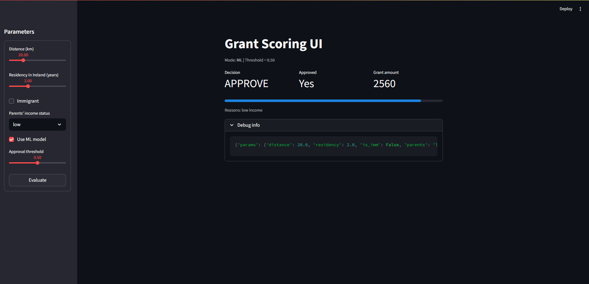
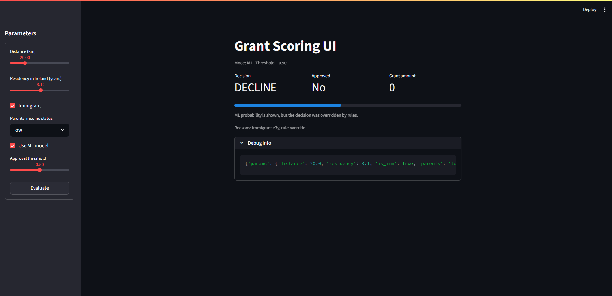

# Grant Scoring: Rules + ML

Two-mode grant scoring system: transparent business rules and a calibrated ML model (logistic regression). Includes a scenario generator, CSV evaluation with bucketed metrics, a FastAPI API, and a Streamlit UI.

## Table of Contents
- [Stack](#stack)
- [Rules](#rules)
- [Repo Structure](#repo-structure)
- [Installation](#installation)
- [Quick Start](#quick-start)
- [Data Generation and Training](#data-generation-and-training)
- [CSV Evaluation](#csv-evaluation)
- [API](#api)
- [UI](#ui)
- [Tests](#tests)
- [Screenshots](#screenshots)
- [License](#license)

## Stack
- Python 3.10+
- FastAPI + Uvicorn
- scikit-learn (LogReg + CalibratedClassifierCV)
- pandas / numpy
- Streamlit
- pytest

## Rules
- **Hard declines**
  - `parents_status == "high"` → decline (`"parents high income"`).
  - `is_immigrant and residency_years_ie >= 3.0` → decline (`"immigrant ≥3y"`).
- **Base rules**
  - `parents_status == "low"` → approve (`"low income"`).
  - `parents_status == "middle"` → approve if `distance_km > 30`, else decline (`"middle & distance ≤30km"`).
- **Amount**: `<= 30 km → 2560`, otherwise `5697`.

## Repo Structure
```
app/
  api/
    routers/scoring.py        # FastAPI router
    main.py                   # FastAPI app
  domain/
    rules.py                  # business rules
    schemas.py                # Pydantic models
  ml/
    generate_scenarios.py     # curated scenarios with labels + buckets
    generate_data.py          # random generator (optional)
    train.py                  # model training
    eval_from_csv.py          # CSV metrics (buckets, AUC/ACC/confusion)
    eval.py                   # rules vs ML offline comparison
  models/
    model.pkl                 # model artifact (gitignored)
  services/
    ml_model.py               # model loading/inference
    scorer.py                 # rules + ML orchestrator
  ui/
    dashboard.py              # Streamlit UI

data/
  raw/                        # input CSVs
  processed/                  # predictions and metrics
docs/
  img/                        # README screenshots
tests/
  test_rules.py
  test_api.py
```

## Installation
```bash
python -m venv .venv
# Windows PowerShell:
. .venv/Scripts/Activate.ps1
pip install -r requirements.txt
cp .env.example .env  # optional
```

## Quick Start
```bash
# 1) Generate controlled scenarios (24k rows, with approved + bucket)
python -m app.ml.generate_scenarios

# 2) Train the model (logistic regression + calibration)
python -m app.ml.train

# 3) Evaluate on CSV and produce metrics per bucket
python -m app.ml.eval_from_csv

# 4) Run API
uvicorn app.api.main:app --reload --port 8000
```

## Data Generation and Training
```bash
python -m app.ml.generate_scenarios     # curated scenarios
# or
python -m app.ml.generate_data          # random data (no labels)

python -m app.ml.train                  # trains and saves app/models/model.pkl
```

## CSV Evaluation
```bash
python -m app.ml.eval_from_csv
# outputs:
# - data/processed/metrics_from_csv.json
# - data/processed/preds_from_csv.csv
```
`metrics_from_csv.json` includes:
- approve rate, ACC@0.50, AUC, best threshold by ACC, confusion matrix,
- buckets:
  - `APPROVE_easy`
  - `DECLINE_high_income`
  - `DECLINE_immigrant>=3y`
  - `BORDER_middle_around_30`
  - `BORDER_immigrant_around_3y`
  - `MIX_random`

## API
Run:
```bash
uvicorn app.api.main:app --reload --port 8000
```
Score sample:
```bash
curl -X POST http://localhost:8000/score   -H "Content-Type: application/json"   -d '{
    "distance_km": 20,
    "residency_years_ie": 2.0,
    "is_immigrant": true,
    "parents_status": "low",
    "use_ml": true,
    "thr": 0.50
  }'
```

## UI
Streamlit dashboard (`app/ui/dashboard.py`) shows mode, decision, probability bar, grant amount, reasons, and debug payload.
```bash
streamlit run app/ui/dashboard.py
```

## Tests
```bash
pytest -q
```

## Screenshots
Place images under `docs/img/` and reference in README:
```markdown


```

## License
MIT. See `LICENSE`.
